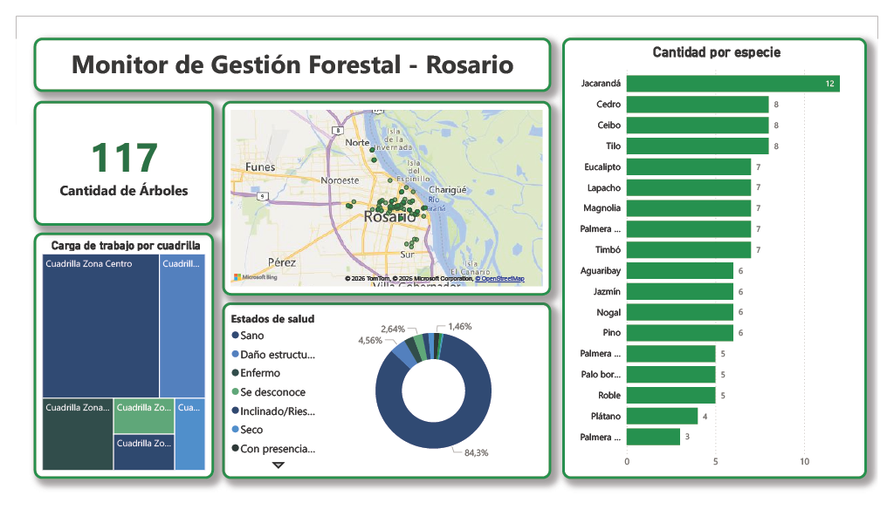

# Sistema de Gestión de Arbolado Público (Rosario) 

Este proyecto presenta el diseño y desarrollo de una base de datos relacional robusta en **T-SQL** para la gestión del arbolado público. El sistema permite administrar integralmente el ciclo de vida de los reclamos ciudadanos, la salud de los ejemplares y la logística de las cuadrillas de mantenimiento.

## Características del Proyecto
- **Modelado Relacional:** Estructura de 13 tablas normalizadas que vinculan árboles, especies, ubicaciones geográficas y personal operativo.
- **Lógica de Negocio:** Implementación de vistas para el seguimiento de tiempos de respuesta y procedimientos almacenados para la gestión de tareas pendientes.
- **Optimización:** Uso de índices no agrupados (`NONCLUSTERED INDEX`) para mejorar la performance en consultas frecuentes por cuadrilla y especie.

## Tecnologías utilizadas
- **Motor:** Microsoft SQL Server
- **Lenguaje:** T-SQL
- **Herramientas de Visualizacion y Diseño:** Power BI, Draw.io

## Modelo de Datos (DER)

## Instalación y Ejecución
Para montar la base de datos localmente, ejecute los scripts en el siguiente orden:
1. `sql/01_creacion_tablas.sql` (Crea la base de datos y el esquema).
2. `sql/02_insercion_datos.sql` (Carga el set de datos de prueba).
3. `sql/03_vistas.sql` & `sql/05_procedimientos.sql` (Carga la lógica programada).

## Consultas de Negocio Destacadas
Dentro del archivo `04_consultas_negocio.sql` se encuentran soluciones a problemas comunes:
- **Productividad:** Identificación de la cuadrilla con mayor número de tareas realizadas en un periodo.
- **Atención al Ciudadano:** Filtrado de motivos de reclamos con alta demanda sin asignar.
- **Análisis de Datos:** Ranking de los ejemplares más altos por especie utilizando funciones de ventana.

## Visualización y Business Intelligence (Power BI)
Se desarrolló un dashboard interactivo para transformar los datos operativos en decisiones estratégicas. 

### Indicadores Clave (KPIs):
- **Distribución Geográfica:** Mapeo de ejemplares mediante coordenadas `GEOGRAPHY` para identificar focos de riesgo.
- **Estado Sanitario:** Análisis de salud forestal para priorizar intervenciones.
- **Gestión Operativa:** Seguimiento de la carga de trabajo por cuadrilla y eficiencia de respuesta.
> **Nota:** El set de datos de prueba (insercion_datos.sql) utiliza asignaciones aleatorias para las cuadrillas con fines demostrativos de la funcionalidad de los filtros cruzados, por lo que la jurisdicción nominal de la cuadrilla puede no coincidir estrictamente con su ubicación geográfica en esta versión.

## Modelo de Datos (DER)

> **Nota:** El archivo interactivo del dashboard se encuentra en la carpeta `/dashboard`. Es necesario contar con Power BI Desktop para su visualización.
